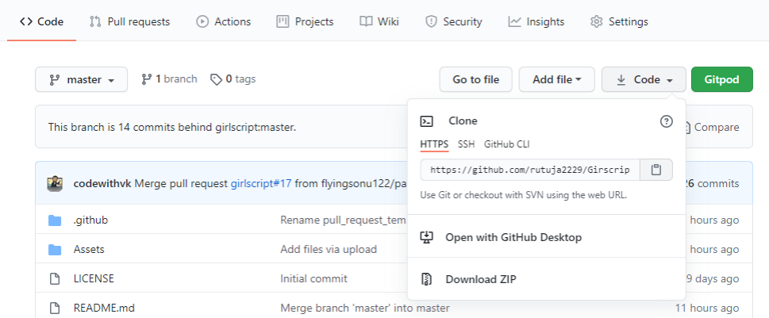
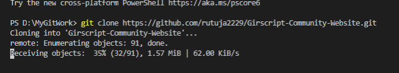

# First Contributions

This project aims to simplify and guide the way beginners make their first contribution. If you are looking to make your first contribution, follow the steps below.

_If you're not comfortable with command line, [here are tutorials using GUI tools.](#tutorials-using-other-tools)_

 

#### If you don't have git on your machine, [install it](https://help.github.com/articles/set-up-git/).

## Fork this repository

Fork this repository by clicking on the fork button on the top of this page.
This will create a copy of this repository in your account.


## Clone the repository





Now clone the forked repository to your machine. Go to your GitHub account, open the forked repository, click on the code button and then click the _copy to clipboard_ icon.

Open a terminal and run the following git command:

```
git clone "url you just copied"
```

where "url you just copied" (without the quotation marks) is the url to this repository (your fork of this project). See the previous steps to obtain the url.




## Create a branch

Change to the repository directory on your computer (if you are not already there):


Now create a branch using the `git checkout` command:

```
git checkout -b your-new-branch-name
```

For example:

```
git checkout -b your_branch_name
```

## Make necessary changes and commit those changes

Now open the file, make the changes u want. Now, save the file.

If you execute the command `git status` on terminal(or git bash), you'll see there are changes.

Add those changes to the branch you just created using the `git add` command:

```
git add your_file_ name
```

Now commit those changes using the `git commit` command:

```
git commit -m "type a message describing your contribution or changes you made"
```


## Push changes to GitHub

Push your changes using the command `git push`:

```
git push origin add-your-branch-name
```

replacing  `add-your-branch-name` with the name of the branch you created earlier.

## Submit your changes for review

If you go to your repository on GitHub, you'll see a `Compare & pull request` button. Click on that button.


Now submit the pull request.


Soon I'll be merging all your changes into the master branch of this project. You will get a notification email once the changes have been merged.

## Where to go from here?

Congrats! You just completed the standard _fork -> clone -> edit -> pull request_ workflow that you'll encounter often as a contributor!

Celebrate your contribution and share it with your friends and followers.


### [Additional material](additional-material/git_workflow_scenarios/additional-material.md)

## Tutorials Using Other Tools

| <a href="gui-tool-tutorials/github-desktop-tutorial.md"></a> | <a href="gui-tool-tutorials/github-windows-vs2017-tutorial.md"></a> | <a href="gui-tool-tutorials/gitkraken-tutorial.md"></a> | <a href="gui-tool-tutorials/github-windows-vs-code-tutorial.md"></a> | <a href="gui-tool-tutorials/sourcetree-macos-tutorial.md"></a> | <a href="gui-tool-tutorials/github-windows-intellij-tutorial.md"></a> |
| ----------------------------------------------------------------------------------------------------------------------------------------------------------- | --------------------------------------------------------------------------------------------------------------------------------------------------------------------------------------------------- | ------------------------------------------------------------------------------------------------------------------- | -------------------------------------------------------------------------------------------------------------------------------------------------------------------------------------------- | ------------------------------------------------------------------------------------------------------------------------------------------------------------------------------------------------------------ | ----------------------------------------------------------------------------------------------------------------------------------------------------------------------------------------- |
| [GitHub Desktop](gui-tool-tutorials/github-desktop-tutorial.md)                                                                                             | [Visual Studio 2017](gui-tool-tutorials/github-windows-vs2017-tutorial.md)                                                                                                                          | [GitKraken](gui-tool-tutorials/gitkraken-tutorial.md)                                                               | [Visual Studio Code](gui-tool-tutorials/github-windows-vs-code-tutorial.md)                                                                                                                  | [Atlassian Sourcetree](gui-tool-tutorials/sourcetree-macos-tutorial.md)                                                                                                                                      | [IntelliJ IDEA](gui-tool-tutorials/github-windows-intellij-tutorial.md)                                                                                                                   |
